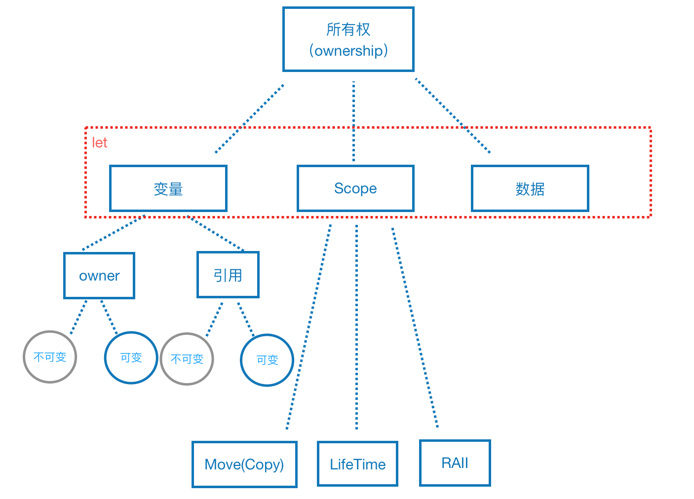

## 语义模型

上图中的语义树，主要是想表达下面几层意思：
1. 所有权是有好多个概念系统性组成的一个整体概念。
2. `let`绑定，绑定了什么？ 变量 + 作用域 + 数据（内存）。
3. `move`、`lifetime`、`RAII`都是和`作用域`相关的，所以想理解它们就先要理解`作用域`。

## 引用的规则
让我们概括一下之前对引用的讨论：
- 在任意给定时间，**要么**只能有一个可变引用，**要么**只能有多个不可变引用。
- 引用**必须**总是有效的。

## slice
- 另一个没有所有权的数据类型是`slice`。`slice`允许你引用集合中一段连续的元素序列，而不用引用整个集合。
- “字符串 slice” 的类型声明写作`&str`
- 字符串字面值就是`slice`

## 参考

- [语义树](https://zhuanlan.zhihu.com/p/27571264)
